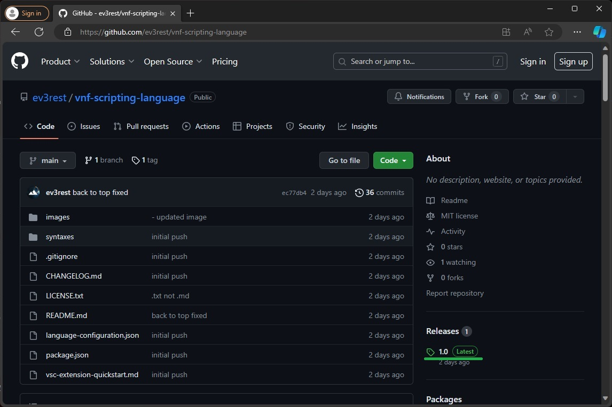
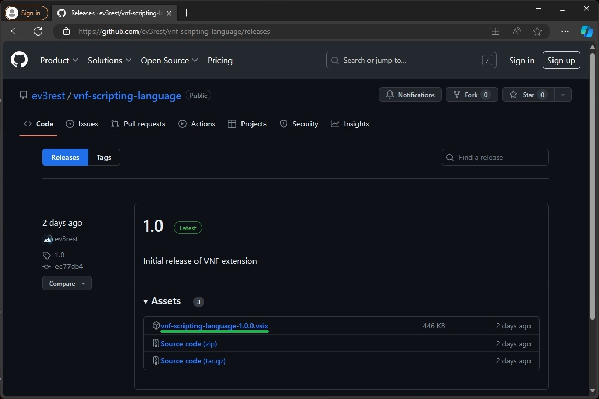
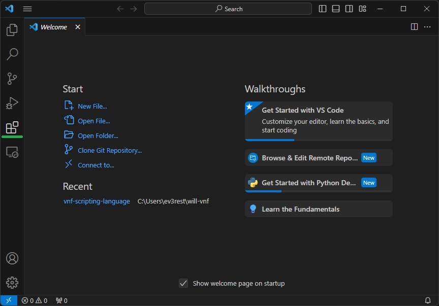
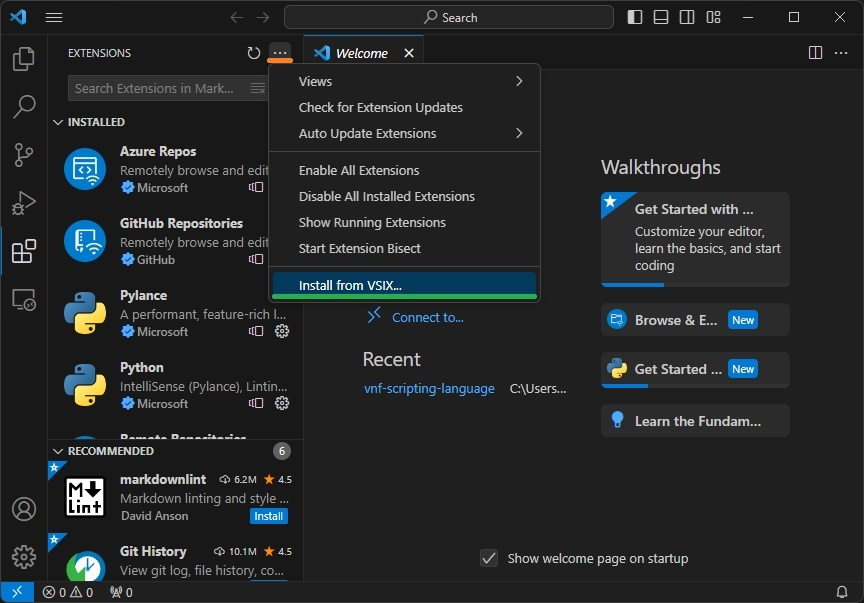
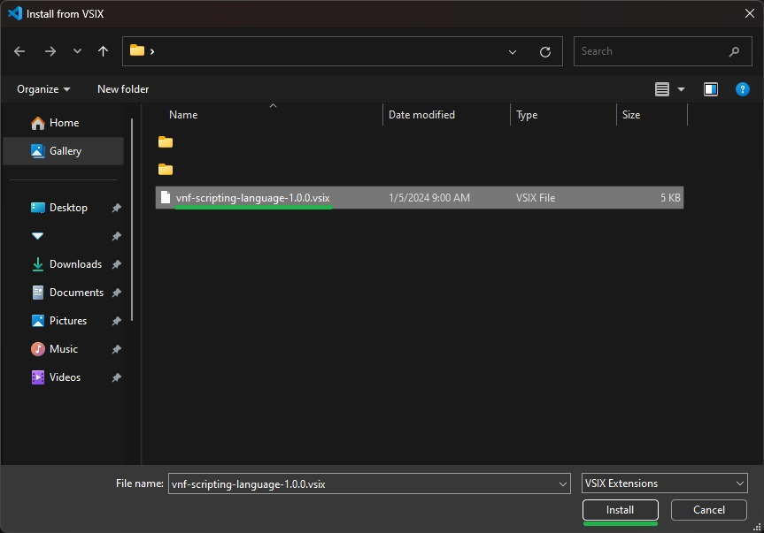
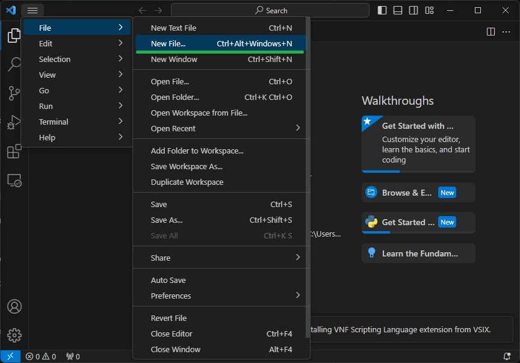
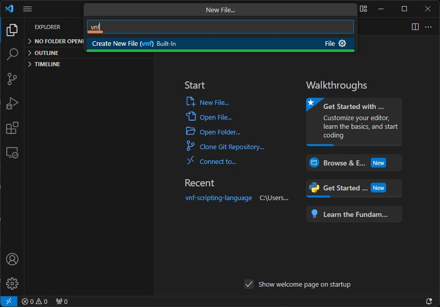

## Features

This extension enables syntax highlighting for VNF scripting laguage files.

<!-- GETTING STARTED -->
## Getting Started

### Prerequisites

- [Visual Studio Code (VSC)](https://code.visualstudio.com/download)

### Download

In order to download the extension, you have to proceed to [Releases](https://github.com/ev3rest/vnf-scripting-language/releases) tab and click on the latest version. The file you are looking for is the `.vsix` file.

Expand to see Screenshots

<space>

### Installation

1. In Visual Studio Code, click on the square icon on the left sidebar to open the Extensions view. Alternatively, you can use the shortcut `Ctrl+Shift+X` (or `Cmd+Shift+X` on Mac).

2. With the **Extensions** view open, look for the "..." menu (More Actions) at the top-right corner of the Extensions pane. Click on it to open the dropdown menu.

    Select `Install from VSIX` from the dropdown menu. This will open a file dialog.

3. In the file dialog, navigate to the location where your .vsix file is saved. Select the file and click Open.

4. After selecting the file, Visual Studio Code will install the extension. This process usually only takes a few seconds.

5. Once the installation is complete, you may be prompted to reload Visual Studio Code to enable the newly installed extension. Click Reload Now if prompted.

6. Click on **File** - **New File**.

7. Type in`VNF` and select the only available option.

8. Create novels! c:

Running from Source

### Running from Source

1. Open new VSCode windows

2. Open the source files folder: **File** - **Open Folder** and select your `vnf-scripting-language` folder.

3. Press F5 to Run

4. This will open a new instance of VSCode with the extension loaded. You should be able to create and open files here.

Building from source would require installation of `vsce` npm package. You should be able to run `vsce package` in this repo's folder and get a packaged extension file (`.vsix`).

## Known Issues

- [ ] Inconsistent highlighting of certain instances of [].

<!-- LICENSE -->
## License

Distributed under the MIT License. See `LICENSE.txt` for more information.

(<a href="#features">back to top</a>)
