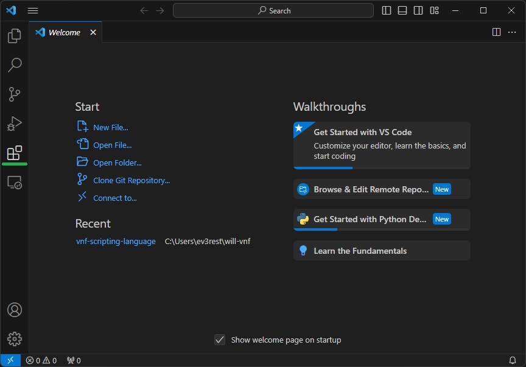
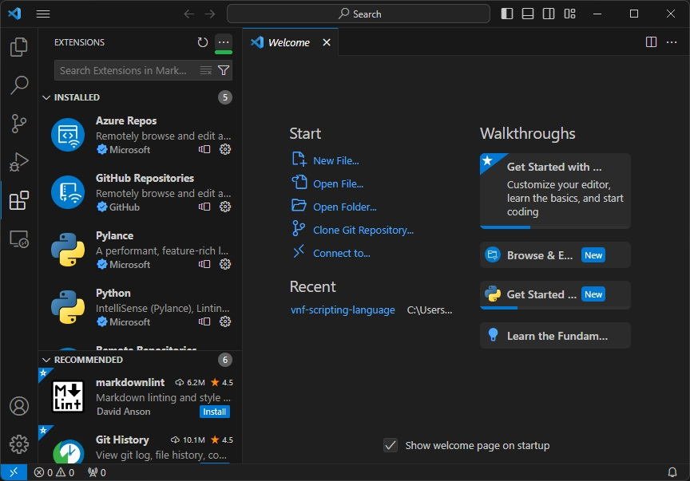
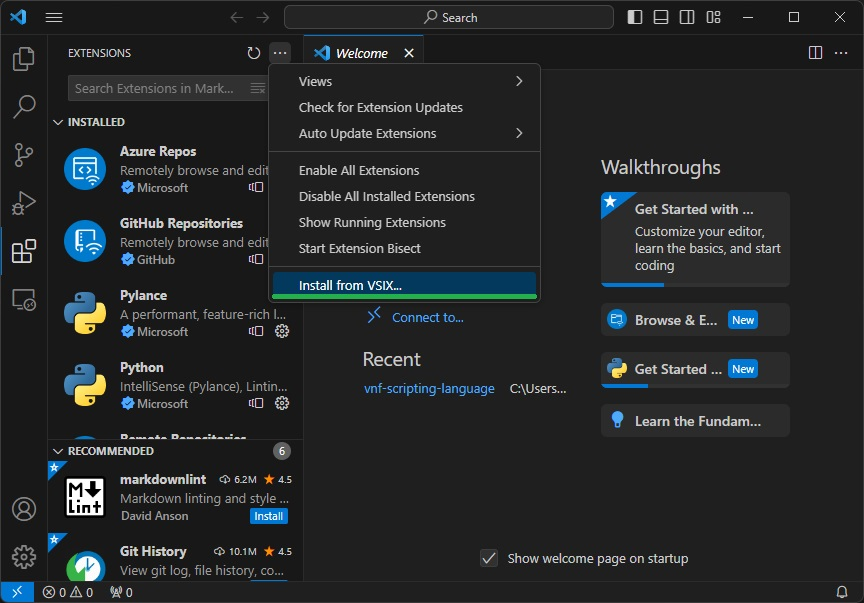
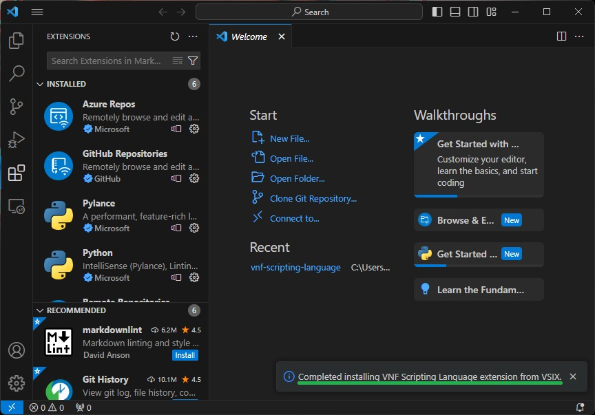
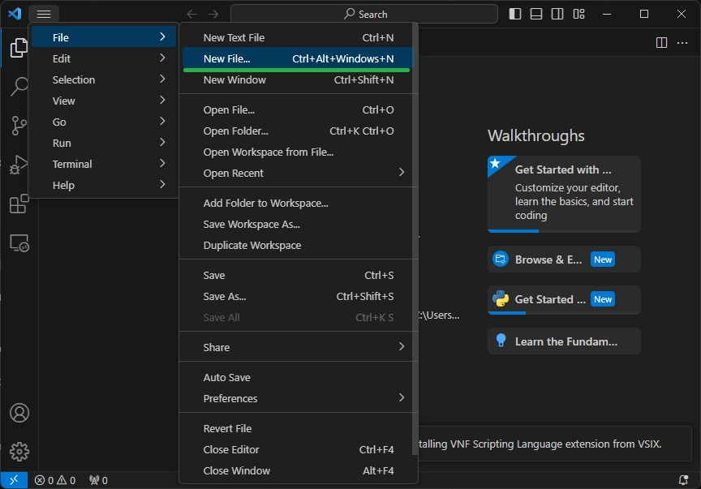
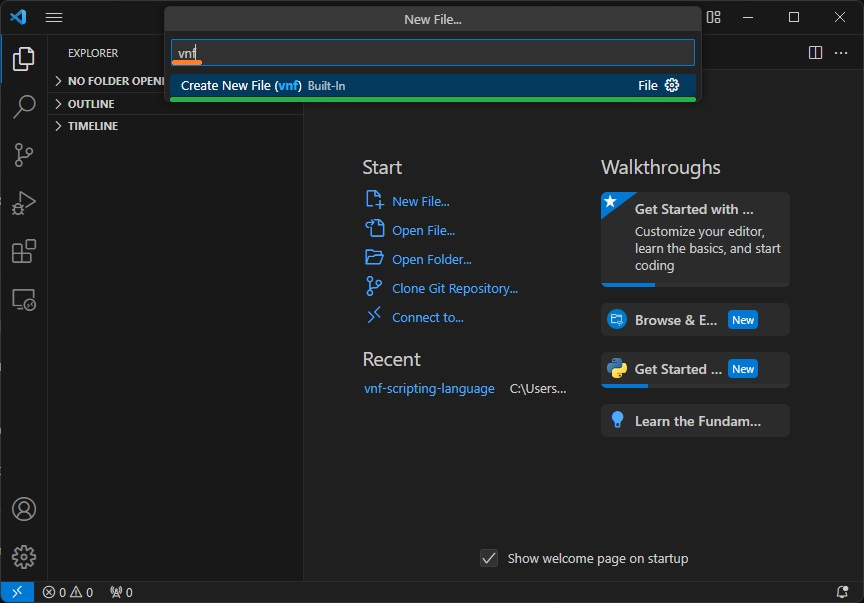

## Features

This extension enables syntax highlighting for VNF scripting laguage files.

<!-- GETTING STARTED -->
## Getting Started

### Prerequisites

- [Visual Studio Code (VSC)](https://code.visualstudio.com/download)

### Installation

1. In Visual Studio Code, click on the square icon on the left sidebar to open the Extensions view. Alternatively, you can use the shortcut `Ctrl+Shift+X` (or `Cmd+Shift+X` on Mac).

2. With the **Extensions** view open, look for the "..." menu (More Actions) at the top-right corner of the Extensions pane. Click on it to open the dropdown menu.

    Select `Install from VSIX` from the dropdown menu. This will open a file dialog.

<space>

3. In the file dialog, navigate to the location where your .vsix file is saved. Select the file and click Open.

4. After selecting the file, Visual Studio Code will install the extension. This process usually only takes a few seconds.

5. Once the installation is complete, you may be prompted to reload Visual Studio Code to enable the newly installed extension. Click Reload Now if prompted.

6. Click on **File** - **New File**.

7. Type in`VNF` and select the only available option.

8. Create novels! c:

## Known Issues

- [ ] Inconsistent highlighting of certain instances of [].

<!-- LICENSE -->
## License

Distributed under the MIT License. See `LICENSE.txt` for more information.

(<a href="#readme-top">back to top</a>)
